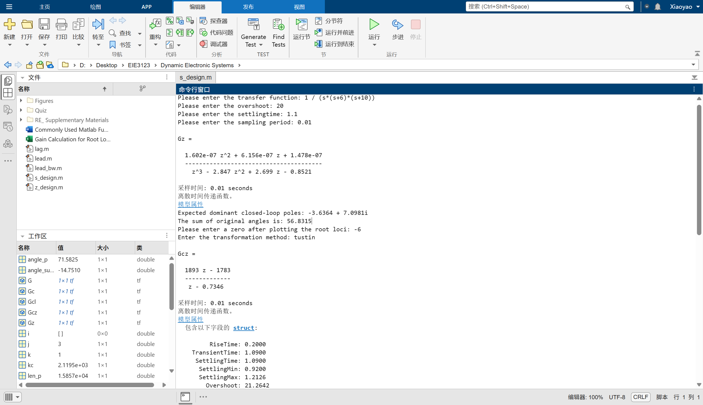
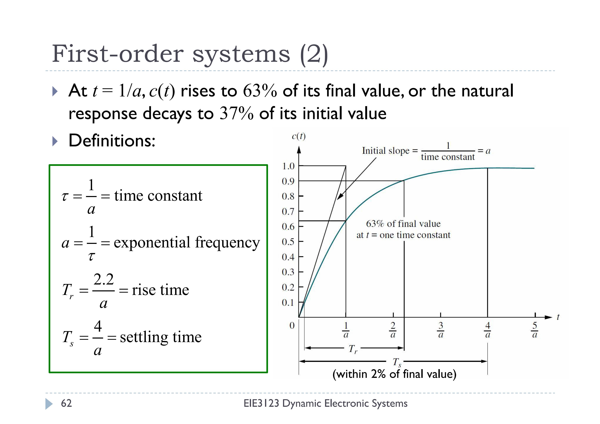
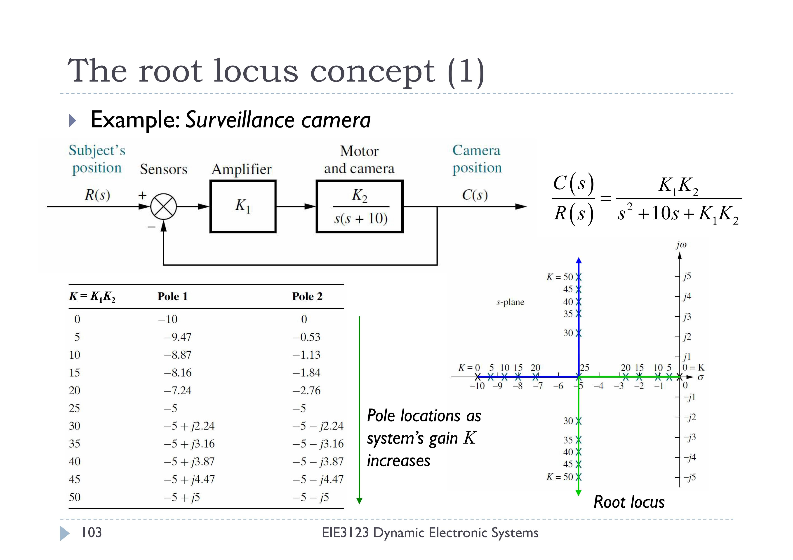
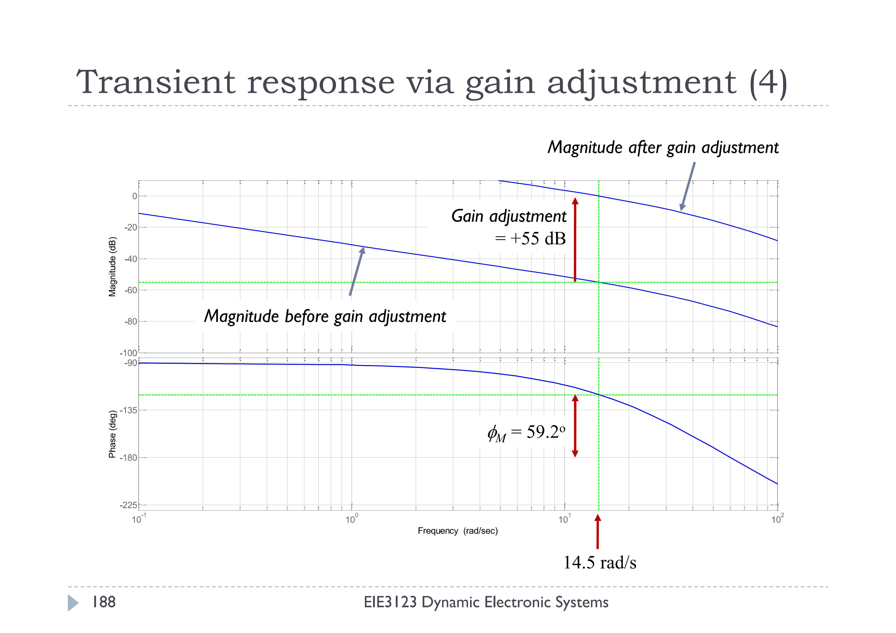

# Dynamic-Electronic-Systems


This repository contains MATLAB scripts for compensator design, take-home quizzes, and supplementary materials for the Feedback Systems subject.

## Repository Structure

```
Dynamic-Electronic-Systems/
├── Quiz/              # Take-home Quizzes
├── RE_Supplementary Materials/                 # Supplementary materials about Laplace Transform
├── lag.m              # Design a lag compensator    
├── lead.m             # Design a lead compensator  
├── lead_bw.m          # Design a lead compensator with bandwidth requirement
├── s_design.m
├── z_design.m
├── Commonly Used Matlab Functions.docx         # Matlab functions used for control systems
└── Gain Calculation for Root Locus.xlsx
```

## Environment Configuration
- MATLAB with the necessary toolboxes, especially Control System Toolbox

## How to Use
1. Users should have basic knowledge about control systems, including stability, steady-state errors, root locus techniques, frequency response techniques, proportional-integral-differential control algorithm, and analog and digital signals.
2. After running the program, follow the instructions in the terminal to input the open-loop transfer function (e.g., type 1 / (s*(s+6)*(s+10))), along with other system index requirements in numbers.

<p align="center">
    Sample instructions in the terminal
</p>


<p align="center">
    Closed-loop step response
</p>


### Root locus techniques
1. You should understand the root locus plot and choose a zero to design a lead compensator.
2. Suggestion: Please choose the timing for A/D conversion as the case may be. In general, choose "s_design.m" for a short sampling period to design the continuous compensator first, then convert it to a discrete equivalent; vice versa.

<p align="center">
    Sample of root locus
</p>

### Frequency response techniques
1. For the frequency response method, you should understand the Nyquist diagram and the Bode Plots. You may need to type phase margin, gain margin, 0dB frequency, and maximum frequency by yourself.

<p align="center">
    Sample of Bode Plots
</p>
